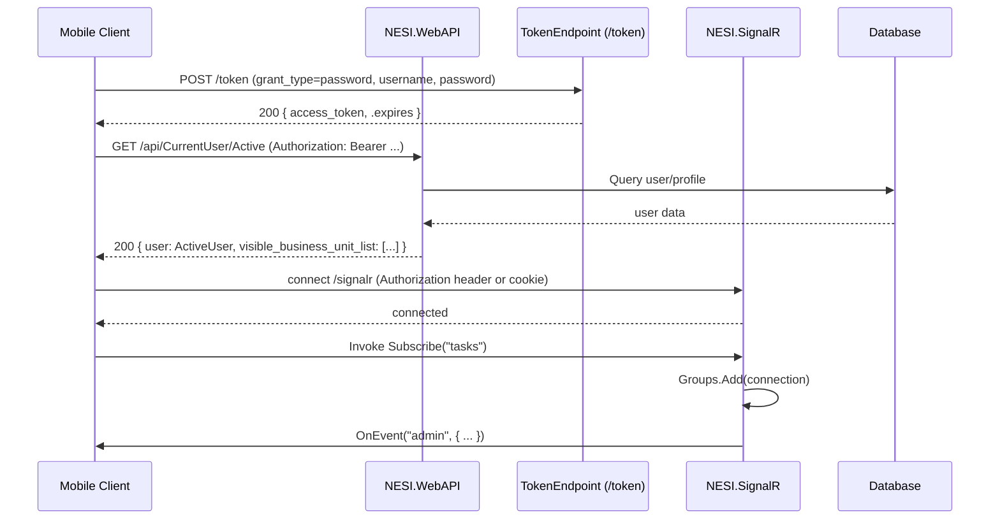

# API & Service Contracts — NESI

Short summary

This document captures API endpoints, SignalR hubs, route prefixes, authentication hints and inferred request/response shapes discovered by static analysis of the repository under CodeBase. It focuses on NESI.WebAPI, NESI.SignalR, Nesi.Web, and Nesi.Mobile usage sites.

**Assumptions**
- The primary HTTP API host is the NESI.WebAPI project; route prefixes use `api/...` as configured by attribute routing and default route `api/{controller}/{id}`.
- OAuth2 token endpoint is at `/token` (configured in Startup.cs) and uses password grant to issue bearer tokens.
- Many DTOs are defined in DTO projects; where not easily resolvable, schemas are marked `inferred` and minimal.
- SignalR hub endpoint is mounted at `/signalr` (NESI.SignalR Startup maps SignalR) and uses standard SignalR hub routes.
- Some controllers inherit from `EmployeeController` or `ApiControllerBase` which add authentication/authorization behavior; endpoints in these controllers typically require authenticated users.
- Where method signatures accept typed models (e.g., `ForgotPasswordModel`), schema fields are inferred from property names in DTO classes if available; otherwise described as `inferred` minimal shapes.


## Scanned files and why relevant
- CodeBase/Nesi.Main/NESI.WebAPI/Startup.cs — OAuth, token path, Web API registration.
- CodeBase/Nesi.Main/NESI.WebAPI/App_Start/SwaggerConfig.cs — swagger registration and token docs.
- CodeBase/Nesi.Main/NESI.WebAPI/App_Start/WebApiConfig.cs — attribute routing, default API route, JSON settings.
- CodeBase/Nesi.Main/NESI.WebAPI/Controllers/API/CurrentUser/SignIn/CurrentUserController.cs — current user endpoints (/api/CurrentUser/*).
- CodeBase/Nesi.Main/NESI.WebAPI/Controllers/API/CurrentUser/SignIn/SignInController.cs — SignIn endpoints (/api/SignIn/*).
- CodeBase/Nesi.Main/NESI.WebAPI/Controllers/API/CurrentUser/SignIn/PasswordController.cs — password endpoints (/api/Password/*).
- CodeBase/Nesi.Main/NESI.WebAPI/Controllers/** — (many controllers scanned) provide page-specific APIs under `api/Page/...`, `api/Core/...`, `api/Cache/...` etc.
- CodeBase/Nesi.Main/Nesi.Mobile/Nesi.Mobile/Services/ApiServices.cs — client usage patterns, token and API base host (`https://api.sparkpowercorp.com` used in production), example endpoints used by mobile client.
- CodeBase/Nesi.Main/NESI.SignalR/Startup.cs, Hubs/EventsHub.cs — SignalR hub routes and hub methods.
- CodeBase/Nesi.Main/Nesi.Web/Controllers/AuthenticationController.cs — additional auth/login/switch/logout endpoints under `api/authentication`.


## Top-level services discovered (indexed)
1. NESI.WebAPI (host: NESI.WebAPI) — RESTful controllers mounted under `/api/*` and `/token` endpoint for OAuth.
2. NESI.SignalR (host: NESI.SignalR) — SignalR hub(s) mounted at `/signalr` exposing `EventsHub` and channels.
3. Nesi.Web (host: Nesi.Web) — website providing `api/authentication` endpoints and server-side session handling; interacts with WebAPI / token flows.


---

## Service: NESI.WebAPI
Repository path(s) scanned: CodeBase/Nesi.Main/NESI.WebAPI/**
Base URL / route prefix: root host; controllers use attribute route prefixes such as `api/CurrentUser`, `api/SignIn`, `api/Password`, `api/Page/...`, default route `api/{controller}/{id}`.
Authentication: OAuth2 bearer tokens (configured in Startup.cs with token endpoint `/token`). Many controllers inherit security behavior via `ApiControllerBase` or `[Authorize]` filter — assume endpoints under EmployeeController require authenticated user.

Endpoints (representative selection)

- GET /api/CurrentUser
  - Description: Get current user summary
  - Parameters: none
  - Response: 200 { /* CurrentUser DTO */ }
  - Auth: Bearer token (inferred). If no current user -> 404.

- DELETE /api/CurrentUser
  - Description: Sign out current user server-side session
  - Response: 200 { data: bool }
  - Auth: Bearer token

- GET /api/CurrentUser/Active
  - Description: Check active/ping status
  - Response: 200 { user: ActiveUser, visible_business_unit_list: [...] } or 404
  - Auth: Bearer token

- POST /api/CurrentUser/Ping
  - Description: Update ping timestamp
  - Request body: none
  - Response: 200 { data: 1 }
  - Auth: Bearer token

- POST /api/CurrentUser/MobileLog
  - Description: Log mobile login activity
  - Request body: DataInt { Data:int } (inferred)
  - Response: 200 { data: ... }
  - Auth: Bearer token

- GET /api/CurrentUser/Privilege/{id}
  - Params: route int id
  - Response: 200 JSON (inferred privilege structure)
  - Auth: Bearer token

- GET /api/CurrentUser/Page/{id}
  - Params: route int id
  - Response: 200 JSON (page authorization info)
  - Auth: Bearer token

- GET /api/CurrentUser/PageUrl/{id}?isMobile={bool}
  - Params: id (route), isMobile (query, optional)
  - Response: 200 string (url) or 404
  - Auth: Bearer token

- POST /api/SignIn/RebootTime/{hostname}
  - Params: hostname (route)
  - Response: 200 JSON (reboot time structure from ReleaseSystem); returns OkD(...)
  - Auth: likely anonymous (no [Authorize] on method)

- POST /api/Password/Forgot
  - Request body: ForgotPasswordModel { Email, maybe Username } (inferred)
  - Response: ApiResult success/failure
  - Auth: anonymous

- POST /api/Password/Request
  - Request body: EmailAddress { Email:string }
  - Response: ApiResult
  - Auth: anonymous

- POST /api/Password/Validate
  - Request body: DataString { Data:string }
  - Response: ApiResult
  - Auth: anonymous

- POST /api/Password/ValidateResetToken
  - Request body: DataString { Data:string, Data2:string } (inferred two fields)
  - Response: ApiResult
  - Auth: anonymous

- POST /api/Password/Reset
  - Request body: ResetPassword { /* fields inferred from DTO ResetPassword */ }
  - Response: ApiResult
  - Auth: anonymous or token depending on flow

Auth/token endpoint (Swagger-docged)
- POST /token
  - Content-Type: application/x-www-form-urlencoded
  - Form fields: grant_type (password), username, password
  - Response: 200 { access_token:string, token_type:string, expires_in:int, .expires:DateTime } (inferred typical OWIN)
  - Notes: swagger adds this path in AuthTokenOperation.

Common headers
- Authorization: Bearer <token>
- Accept: application/json
- Content-Type: application/json (except /token which is form-encoded)

Schemas (inferred)
- ApiResult:
  - { success: bool, message?: string, errors?: [string], data?: any }
  - Source: CodeBase/Nesi.Main/NESI.WebAPI/Models/ApiResult.cs

- DataString (inferred minimal shape): { Data: string, Data2?: string }
- DataInt: { Data: int }
- ForgotPasswordModel (inferred): { Email: string, /* optional name */ }
- ResetPassword (inferred): { Token: string, NewPassword: string, ConfirmPassword?: string }
- CurrentUser / ActiveUser shapes: partial fields inferred in DTOs under NESI.DTO.ViewModels.CurrentUser

Files scanned for schema inference: CodeBase/Nesi.Main/NESI.WebAPI/Models/ApiResult.cs and DTO folders under CodeBase/Nesi.Main/NESI.DTO/**


## Service: NESI.SignalR
Repository path(s) scanned: CodeBase/Nesi.Main/NESI.SignalR/**
Base endpoint: /signalr (mapped in Startup.cs with app.MapSignalR())
Transport: SignalR (WebSockets/long-polling)
Auth: likely uses same cookie or bearer token depending on hosting; hub methods don't show explicit [Authorize] but application may enforce auth via OWIN pipeline.

Hub: EventsHub
- Methods clients can call:
  - Subscribe(string channel) -> adds connection to group `channel` and publishes user.subscribed event
  - Unsubscribe(string channel)
  - Publish(ChannelEvent channelEvent)
  - SendToOthers(string sender, string message)
  - SendToAll(string sender, string message)
  - SendToAllAdvance(AdvanceEvent model)
- Events client can receive (server calls): OnEvent(channelName, ChannelEvent) and Fire(...) depending on client-side hub proxy

ChannelEvent (inferred schema)
- { Name: string, ChannelName: string, Timestamp: DateTimeOffset, Data: any, Json: string }

AdvanceEvent (inferred schema)
- { UserId:int, From:string, To:string, Message:string, Function:string, Params:string, Data:string, Value:string, Time:DateTime }

Typical SignalR flow
- Client connects to `/signalr/hubs` or `/signalr` and invokes `EventsHub.Subscribe('tasks')`.
- Server groups used for broadcasting; admin channel receives copies of published events.


## Service: Nesi.Web
Repository path(s) scanned: CodeBase/Nesi.Main/Nesi.Web/**
Base route prefixes: `api/authentication` (AuthenticationController)

Representative endpoints
- POST /api/authentication/login
  - Request body: LoginModel { Username:string, Password:string }
  - Response: 200 OK on success, 401 Unauthorized on failure
  - Auth: anonymous

- POST /api/authentication/switchUser
  - Request body: SwitchUserModel { Id:int }
  - Response: 200 OK if switched; 401 if unauthorized
  - Auth: [Authorize]

- POST /api/authentication/token-login
  - Description: Authenticate using existing OAuth bearer token — server then creates local session
  - Auth: [Authorize] required (token in header)

- POST /api/authentication/logout
  - Response: Ok

Notes: Nesi.Web appears to integrate with NESI.WebAPI token flow and session management.


---

## System diagrams and main flows (Mermaid)

### System overview (flowchart)

```mermaid
flowchart LR
  subgraph Clients
    Browser[Browser UI]
    Mobile[Nesi.Mobile]
  end
  subgraph API
    WebAPI[NESI.WebAPI]
    SignalR[NESI.SignalR]
    NesiWeb[Nesi.Web]
  end
  subgraph DataStores
    DB[(Database)]
  end

  Browser -->|XHR /api/* (Authorization: Bearer)| WebAPI
  Mobile -->|XHR /api/* + /token| WebAPI
  Browser -->|SignalR connect| SignalR
  Mobile -->|SignalR connect| SignalR
  WebAPI -->|DB queries| DB
  NesiWeb -->|session/SSR| WebAPI
  SignalR -->|writes/reads| DB
```
```


### Main flow: Authentication and data request (sequence)


```


## Files & folders scanned (short notes)
- CodeBase/Nesi.Main/NESI.WebAPI/Controllers/API/CurrentUser/SignIn/CurrentUserController.cs — current user endpoints
- CodeBase/Nesi.Main/NESI.WebAPI/Controllers/API/CurrentUser/SignIn/SignInController.cs — sign-in helper endpoints
- CodeBase/Nesi.Main/NESI.WebAPI/Controllers/API/CurrentUser/SignIn/PasswordController.cs — password reset flows
- CodeBase/Nesi.Main/NESI.WebAPI/App_Start/SwaggerConfig.cs — docs, token description
- CodeBase/Nesi.Main/NESI.WebAPI/App_Start/WebApiConfig.cs — routing and JSON conventions
- CodeBase/Nesi.Main/NESI.WebAPI/Models/ApiResult.cs — standardized API result shape
- CodeBase/Nesi.Main/NESI.SignalR/Hubs/EventsHub.cs & Startup.cs — SignalR hub methods and mapping
- CodeBase/Nesi.Main/Nesi.Mobile/Nesi.Mobile/Services/ApiServices.cs — mobile usage of /token and /api/CurrentUser/Active and contacts endpoint example (/api/Contacts)
- CodeBase/Nesi.Main/Nesi.Web/Controllers/AuthenticationController.cs — login/switch/logout endpoints
- Additional controllers in NESI.WebAPI/Controllers/** — many page-specific controllers (Customers, Vendors, WorkOrder, Timesheet, Reports, etc.). These follow conventions (EmployeeController base) and expose grid endpoints and CRUD operations under `api/Page/*` and `api/*`.


## Recommendations / Next steps
- Generate a Swagger/OpenAPI JSON by starting the WebAPI locally (or by invoking the SwaggerConfig pipeline) to capture exact schemas for all controllers.
- Add or enable attribute-based XML comments on controllers/DTOs and enable Swagger XML comments to improve contract accuracy.
- Create small integration tests (or run the running app) to exercise token flow and a few representative endpoints to validate inferred schemas.


---

Generated on: 2026-06-23

