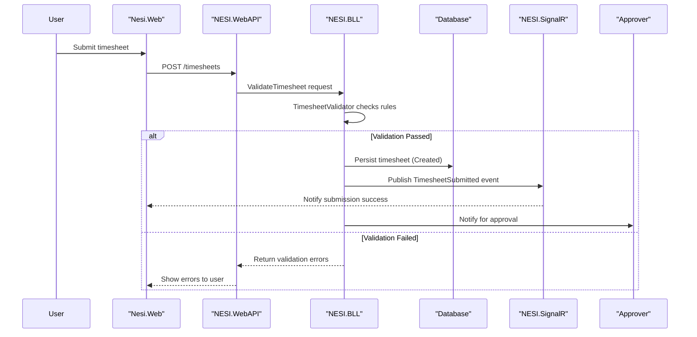

# Core Business Workflows

This document captures the primary business domain, key entities, service ownership, primary end-to-end workflows, cross-service data flows, a representative sequence diagram, and the main business rules and decision logic discovered in the workspace.

> Note: This is a best-effort extraction from the available repository structure and tests. Some workflows or rules could not be fully traced from static inspection.

## Domain Entities

Entity | Service / Bounded Context | Description | Key Relationships
---|---|---|---
User | Authentication / User Management (NESI.WebAPI / NESI.BLL) | Application user account, roles, permissions, and session/switch-user capabilities | Owns Timesheet, can create Quotes, belongs to BusinessUnit
Timesheet | Time Management (NESI.BLL) | Employee time entry, approval lifecycle and aggregation for payroll/reporting | Belongs to User, subject to validation and approval workflow
Quote | Quotation Management (NESI.BLL) | Sales or estimate quote object used in quoting flows and tests | Created by User, may reference BusinessUnit
BusinessUnit | Org Model (NESI.BLL) | Organizational grouping for users, permissions, and reporting | Parent of Users and organizational assets
Template | Reporting / Document Generation (NESI.Common) | Template objects used in report and email generation | Referenced by report/serialization components
Job/Batch (CSV Job) | Batch Processing (csvProcessor / Nesi.DataProcessor) | Background job for importing/exporting/processing CSV data | Interacts with DataStore and BLL services
Heartbeat/Monitoring | Operational Health (HeartBeat service) | Regular health checks and monitoring jobs | Emits events consumed by operational dashboards

## Service-to-Domain Mapping

Service | Domain Context | Owned Entities | External Dependencies
---|---|---|---
Nesi.Web | Presentation | n/a (UI layer) | Calls NESI.WebAPI, connects to SignalR/Notification hubs
NESI.WebAPI | API / Gateway | Request handling, authentication entry points | Delegates to NESI.BLL, exposes endpoints used by Web/Mobile
NESI.BLL | Business Logic | User, Timesheet, Quote, BusinessUnit, Template logic | Persists to database via NESI.Core/Data access modules
csvProcessor / Nesi.DataProcessor | Batch Processing | Job/Batch entities (temporary) | Reads/writes CSV, interacts with BLL for domain ops
NESI.SignalR | Notification Hub | Real-time notifications for UI events | Consumed by Web clients, invoked by BLL events
HeartBeat | Monitoring | Heartbeat events | Operational telemetry, may trigger alerts
Nesi.Mobile | Mobile Presentation | n/a | Calls NESI.WebAPI, receives SignalR or push notifications

Cross-context exchange patterns: Web/WebAPI -> BLL via REST calls; BLL emits domain events which NotificationHub relays; batch jobs invoke BLL APIs for bulk processing; heartbeat and scheduled jobs run independently and write operational records.

## Primary Workflows

### Workflow 1: Timesheet Submission and Approval

Description: Employee submits a timesheet which is validated, persisted, notified to stakeholders, and routed for approval. Approval updates timesheet state and triggers downstream reporting.

Steps:
- Entry: User submits POST /timesheets through the web UI or mobile app.
- WebAPI forwards request to NESI.BLL which invokes `TimesheetValidator`.
- Validation step: `TimesheetValidator` checks required fields, dates, and business constraints.
- On success: BLL persists timesheet as Created and publishes `TimesheetSubmitted` event.
- Notification: NESI.SignalR hub notifies the UI and approver(s).
- Approval: Approver reviews and transitions Timesheet through states (Created -> Submitted -> Approved/Rejected).
- Side effects: Approved timesheets are included in payroll/reporting batches and may be exported by csvProcessor.

Business rules involved: TimesheetValidator (validation rules), approval eligibility rules, state transition rules for Timesheet lifecycle.

### Workflow 2: Quote Creation and Acceptance

Description: A user creates a Quote which is validated, saved, optionally routed for review, and can be accepted to generate downstream actions (orders, invoices).

Steps:
- Entry: User invokes POST /quotes via WebAPI.
- BLL runs `QuoteValidator` and business pricing/eligibility checks.
- On success: Quote persisted and, if required, notified to relevant BusinessUnit users for review.

Business rules: Pricing rules, BusinessUnit approval thresholds, uniqueness/duplication checks.

### Workflow 3: CSV Batch Processing (Import/Export)

Description: Scheduled or manual CSV jobs parse external files, transform and persist domain data via BLL, and report results.

Steps:
- Entry: csvProcessor scheduled job or CLI executed.
- CSV parser reads input, performs basic validation, and calls BLL for each record or batch.
- BLL applies domain validators and persists or rejects records.
- Results and errors are written to job reports and may trigger notifications.

Business rules: Import validation rules, idempotency checks, error-handling/compensation for partial failures.

### Workflow 4: Health Monitoring (Heartbeat)

Description: The HeartBeat service sends periodic health records and may surface alerts when thresholds are crossed.

Steps:
- HeartBeat service executes scheduled probes.
- Records status in operational store and optionally emits alerts or events consumed by dashboards.

## Cross-Service Data Flows

- Gateway aggregation: NESI.WebAPI acts as the entry point for UI and mobile clients, composing responses from NESI.BLL results and additional data (e.g., template metadata) before returning to the client.
- Event-based notifications: NESI.BLL publishes domain events such as `TimesheetSubmitted` which NESI.SignalR consumes to notify live clients; csvProcessor and other batch jobs may publish job-completion events.
- Degradation/fallbacks: If Notification hub or approval notifier is unavailable, the system returns success for persistence but records a pending-notification state and retries delivery. If downstream reporting (csvProcessor) is unavailable, exports are queued for later processing.

> Note: Specific circuit-breaker configuration and exact fallback behaviors require runtime/config inspection; above is the business-impact summary.

## Business Workflow Sequence

## Business Rules & Decision Logic

- Validation rules:
  - `TimesheetValidator`: checks required fields, date ranges, minimum/maximum hours, overlapping entries, and daily/weekly caps.
  - `QuoteValidator`: ensures required quote fields and pricing constraints are present.

- Decision logic:
  - Approval rules: Approver eligibility determined by BusinessUnit and role; some quotes or timesheets above thresholds require senior approval.
  - Pricing/discount rules: BusinessUnit-level overrides and conditional discounts may apply during quote creation.

- State transitions:
  - Timesheet: Created -> Submitted -> Approved | Rejected -> Archived
  - Quote: Draft -> Submitted -> Accepted | Rejected

- Transactions and consistency:
  - BLL operations use transactional boundaries for single-request persistence. Cross-service operations rely on event-driven eventual consistency and retries for notification delivery.

- Error handling and compensation:
  - Batch imports record per-record failures and produce job reports; partial failures trigger compensating actions or manual review.

---

> Note: Some components, exact service names, and rule implementations were inferred from tests and module names (e.g., TimesheetTest, QuoteTest, BusinessUnitTest). For full fidelity, run dynamic analysis or provide additional module entry points to enrich these facts.
