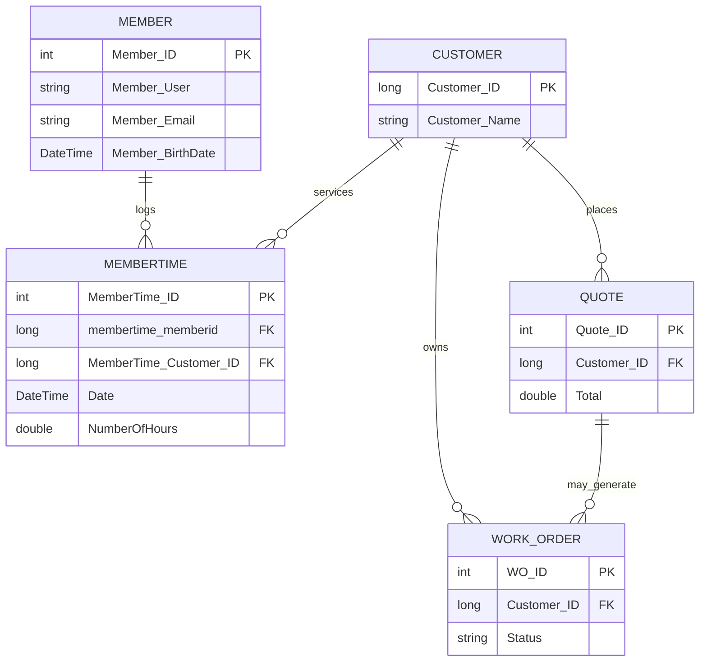

# NESI Data Architecture Report

**Generated:** 2026-06-23

## Executive Summary

This report summarizes the data architecture discovered in the CodeBase/Nesi.Main repository. Primary persistent store: MySQL ("neintranet" database). Data access is implemented using a mix of Entity Framework (EDMX/EF6), DevExpress XPO, direct MySQL connectors, and raw SQL scripts. DTOs in `NESI.DTO` map to EF/Entities classes under `NESI.Data.Entities`.

Key service boundaries: Web (Nesi.Web), WebAPI (NESI.WebAPI), DataProcessor and background services (NESI.DataProcessor, HeartBeat), BLL layer (NESI.BLL) and caching layer (NESI.Cache). Most data models are generated from `Entities.Model.edmx` in `NESI.Data/Entities`.

## Data Model Overview

- Primary entity namespace: `NESI.Data.Entities` (generated from `Entities/Model.edmx`). See [CodeBase/Nesi.Main/NESI.Data/Entities](CodeBase/Nesi.Main/NESI.Data/Entities).
- DTO mappings: Many DTO classes use AutoMapper attributes mapping to data entities. See examples:
  - `NESI.DTO.Models.Users.Member` -> maps to `NESI.Data.Entities.member` ([CodeBase/Nesi.Main/NESI.DTO/Models/Users/Member.cs](CodeBase/Nesi.Main/NESI.DTO/Models/Users/Member.cs)).
  - `NESI.DTO.Models.TimeSheet.MemberTime` -> `NESI.Data.Entities.membertime` ([CodeBase/Nesi.Main/NESI.DTO/Models/TimeSheet/MemberTime.cs](CodeBase/Nesi.Main/NESI.DTO/Models/TimeSheet/MemberTime.cs)).

- Representative entities (non-exhaustive): `member`, `membertime`, `customer`, `quote`, `work_order`, `inventory`, `invoice`, `payroll`, `vendor`, `ticket`, `journal_entry`, and many view objects `vw_*` present as generated classes under `NESI.Data/Entities`.

- Attributes: DTOs and Entities include many typed attributes (int, long, string, DateTime?, decimal/double, sbyte, bool). Entities frequently include audit fields such as `ts`, `Created_Date`, `Modified_Date`, and owner fields like `Member_ID` or `business_unit_id`.

- Keys and relationships: The EDMX model provides relationships; generated classes and naming indicate primary keys such as `Member_ID`, `MemberTime_ID`, `Customer_ID`, `quote_id` and foreign keys like `membertime_memberid`, `MemberTime_Customer_ID`. Lookups and many-to-many relationships are represented via linking tables (e.g., `member_skills`, `inventory_tag_link`).

## Persistence Technologies

- Relational DB: MySQL (multiple connection strings referencing database `neintranet`). Examples:
  - [CodeBase/Nesi.Main/NESI.Data/App.config](CodeBase/Nesi.Main/NESI.Data/App.config) (connection string name: `NESIMySQL`)
  - [CodeBase/Nesi.Main/Nesi.Web/Configuration/Production/connection_strings.config](CodeBase/Nesi.Main/Nesi.Web/Configuration/Production/connection_strings.config)
  - [CodeBase/Nesi.Main/HeartBeat/Configuration/connection_strings_development.config](CodeBase/Nesi.Main/HeartBeat/Configuration/connection_strings_development.config)

- ORMs and access patterns:
  - Entity Framework 6 + EDMX model (`NESI.Data/Entities/Model.edmx` and generated `Entities.Model.*`). Many classes under `NESI.Data.Entities` are code-gen outputs.
  - MySql.Data + EntityClient provider (providerName `MySql.Data.MySqlClient` / `System.Data.EntityClient`).
  - DevExpress XPO usage (XPO connection strings `MySQLXPO` present in HeartBeat and Web configurations).
  - Direct ADO usage and raw SQL via helper extensions (e.g., `NESIMySQLExtensions.cs` which provides DataTable helpers on `DbContext`).

- Caching:
  - In-memory caching using `System.Runtime.Caching.MemoryCache` implemented in `NESI.Cache/MemoryCacher.cs` and used by multiple cache types (OnlineUser, BusinessUnit, TaxEntity).

- File stores and config-driven resources:
  - SQL scripts stored under `CodeBase/Nesi.Main/SQL-scripts` and `DeploymentScripts` (schema and DML hints). Example: `NESI-DML.sql`.
  - App and web configuration files for environment-specific connection strings in `Nesi.Web/Configuration` and `HeartBeat/Configuration`.

## Entity-Relationship Diagrams (Mermaid)

Below is a high-level ER diagram representing primary entities and relationships (extracted from DTOs and generated entities). This is a simplified view; the full model contains 500+ tables.



Notes: Many linking tables exist (e.g., `member_skills`, `inventory_tag_link`) and multiple `vw_*` view classes map to read-only projections.

## Data Flows Between Services (Mermaid)

High-level flow between components: Web UI -> WebAPI -> BLL -> Data Access -> MySQL; background processors (DataProcessor, HeartBeat) interact directly with DB and trigger processes like sync to NetSuite.

```mermaid
flowchart LR
    subgraph UI
      A[Nesi.Web (Angular + Views)]
    end
    subgraph API
      B[NESI.WebAPI]
    end
    subgraph BLL
      C[NESI.BLL]
    end
    subgraph DataLayer
      D[NESI.Data (EF6 / XPO)]
      DB[(MySQL: neintranet)]
    end
    subgraph Background
      E[NESI.DataProcessor]
      F[HeartBeat]
    end

    A -->|HTTP/JSON| B
    B -->|calls| C
    C -->|EF / StoredProc| D
    D -->|SQL| DB
    E -->|batch jobs| DB
    F -->|heartbeat / monitoring| DB
    B -->|reads cache| G[MemoryCache]
    C -->|writes cache| G
    E -->|sync| H[External Systems (NetSuite, 3rd-party)]
```

## Configuration Locations

- Primary connection strings & providers:
  - [CodeBase/Nesi.Main/NESI.Data/App.config](CodeBase/Nesi.Main/NESI.Data/App.config) (provider registration and `NESIMySQL` connection string)
  - [CodeBase/Nesi.Main/Nesi.Web/Configuration/Production/connection_strings.config](CodeBase/Nesi.Main/Nesi.Web/Configuration/Production/connection_strings.config)
  - [CodeBase/Nesi.Main/HeartBeat/Configuration/connection_strings_development.config](CodeBase/Nesi.Main/HeartBeat/Configuration/connection_strings_development.config)
  - Environment variants present under `Nesi.Web/Configuration/*` and `HeartBeat/Configuration/*` (Development, Production, MattLocal, etc.).

- ORM model:
  - EDMX model and generated code: [CodeBase/Nesi.Main/NESI.Data/Entities/Model.edmx](CodeBase/Nesi.Main/NESI.Data/Entities/Model.edmx) and [CodeBase/Nesi.Main/NESI.Data/Entities/Model.Designer.cs](CodeBase/Nesi.Main/NESI.Data/Entities/Model.Designer.cs).

- SQL scripts & schema hints:
  - [CodeBase/Nesi.Main/SQL-scripts/NESI-DML.sql](CodeBase/Nesi.Main/SQL-scripts/NESI-DML.sql)
  - [CodeBase/Nesi.Main/DeploymentScripts](CodeBase/Nesi.Main/DeploymentScripts) (contains versioned SQL migration files).

- Caching config & code:
  - [CodeBase/Nesi.Main/NESI.Cache/MemoryCacher.cs](CodeBase/Nesi.Main/NESI.Cache/MemoryCacher.cs)

## Migration Notes

Potential blockers and considerations for migrating to cloud or modern platform:

- Credential Exposure: Multiple connection strings in repo include usernames and passwords (e.g., `nesiappuser` and passwords visible in config files). These must be rotated and moved to secure secrets stores.

- Large EF Edmx Model: The monolithic EDMX (500+ entities) complicates migration to EF Core; EF Core does not support EDMX directly. Consider incremental rewrite, or use a database-first EF Core scaffold, and validate mapping differences (e.g., provider-specific types).

- XPO usage: DevExpress XPO-based code paths (e.g., `MySQLXPO`) may require porting or replacing with EF Core or other ORMs if migrating away from XPO.

- Stored procs / SQL scripts: The `DeploymentScripts` and `SQL-scripts` include environment-specific DML and schema changes; ensure migration plans include schema versioning (Flyway, Liquibase) or EF Core Migrations equivalents.

- Views and legacy naming: Many `vw_*` classes & denormalized structures are used; migrating to a normalized schema or to managed views requires careful testing.

- Audit / Binary Data: Some tables reference file storage or document links (e.g., `ticket_files`, `vendor_documents`); check whether files are stored on disk vs DB; plan for object storage migration if needed.

- Data Volume & Performance: Inventory, payroll, and finance tables likely have high cardinality; test performance when moving to cloud MySQL variants (RDS/Aurora) and consider read replicas, indexing, and caching strategies.

## Recommendations

- Secrets: Remove plaintext credentials from repo; replace with secret store (Azure Key Vault, AWS Secrets Manager) and environment configs.

- Incremental DB Migration:
  - Start by exporting schema and using a schema migration tool (Flyway/Liquibase) to version; create a CI job to apply migrations to test environments.
  - For EF: scaffold EF Core models from the existing MySQL schema into separate projects and migrate critical modules first (e.g., authentication, customers, timesheets), validate behavior and tests.

- Caching & Performance:
  - Keep MemoryCache for local caching but introduce a distributed cache (Redis) for multi-instance deployments.

- Tests & Data Validation:
  - Add integration tests around data access layers and service contracts; create an anonymized dataset for verification.

- Replace EDMX / XPO gradually:
  - Identify low-risk domains for early migration (read-only reporting views) and rebuild data access with EF Core or Dapper where appropriate.

- Quick Wins:
  - Externalize configuration and secrets.
  - Add migration/versioning tooling for DB scripts in `DeploymentScripts`.
  - Add lightweight health checks for DB connectivity in `HeartBeat` and `WebAPI`.

- Risks:
  - Breaking mappings between DTOs and Entities when re-scaffolding models.
  - Downtime for heavy schema migrations without online migrations.
  - Hidden provider-specific SQL or features in stored procs.

## References (selected files)

- `NESI.Data` EDMX and entities: [CodeBase/Nesi.Main/NESI.Data/Entities/Model.edmx](CodeBase/Nesi.Main/NESI.Data/Entities/Model.edmx) and [CodeBase/Nesi.Main/NESI.Data/Entities](CodeBase/Nesi.Main/NESI.Data/Entities)
- DTO examples: [CodeBase/Nesi.Main/NESI.DTO/Models/Users/Member.cs](CodeBase/Nesi.Main/NESI.DTO/Models/Users/Member.cs), [CodeBase/Nesi.Main/NESI.DTO/Models/TimeSheet/MemberTime.cs](CodeBase/Nesi.Main/NESI.DTO/Models/TimeSheet/MemberTime.cs)
- Connection strings: [CodeBase/Nesi.Main/NESI.Data/App.config](CodeBase/Nesi.Main/NESI.Data/App.config), [CodeBase/Nesi.Main/Nesi.Web/Configuration/Production/connection_strings.config](CodeBase/Nesi.Main/Nesi.Web/Configuration/Production/connection_strings.config), [CodeBase/Nesi.Main/HeartBeat/Configuration/connection_strings_development.config](CodeBase/Nesi.Main/HeartBeat/Configuration/connection_strings_development.config)
- Cache implementation: [CodeBase/Nesi.Main/NESI.Cache/MemoryCacher.cs](CodeBase/Nesi.Main/NESI.Cache/MemoryCacher.cs)
- SQL scripts: [CodeBase/Nesi.Main/SQL-scripts/NESI-DML.sql](CodeBase/Nesi.Main/SQL-scripts/NESI-DML.sql), [CodeBase/Nesi.Main/DeploymentScripts](CodeBase/Nesi.Main/DeploymentScripts)

---

*End of report.*
